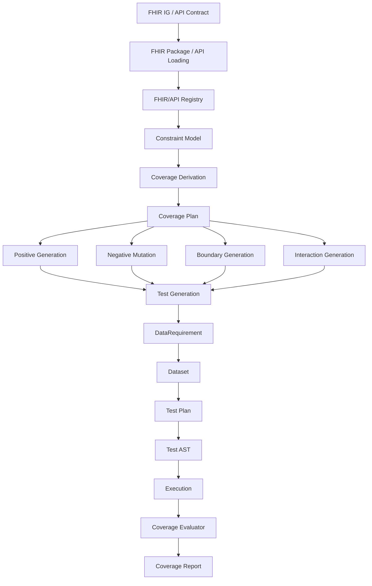

# Momus Architecture

Momus is a testing framework for API and FHIR conformance testing. This
document describes the production architecture that the implementation is
growing into.

The central architectural principle is:

"Momus defines completeness in terms of contractual coverage obligations, not
exhaustive enumeration of all possible input permutations."

Momus must not attempt to prove completeness by generating every possible
FHIR/API value permutation. Instead, it derives a finite set of explicit,
machine-verifiable coverage obligations from the selected FHIR and API
contracts, generates tests that satisfy those obligations, executes them, and
then independently evaluates whether the required obligations were covered.

That distinction makes the system defensible and computationally tractable.
Completeness means that every required constraint and interaction defined by
the selected coverage strategy has been exercised, not that a large but
opaque number of tests happened to run.

## Dependency direction

Dependencies flow downward. A layer may depend on the layers below it, never
on the layers above it.



Key rules:

- The registry never generates tests.
- The constraint model does not execute tests.
- The coverage plan defines what must be tested; it is not inferred after the
        fact from whatever tests happened to run.
- Dataset is not responsible for coverage.
- The test AST is not responsible for defining coverage requirements.
- The runner never sees raw FHIR package files.

## End-to-end pipeline

Momus reasons about conformance through a fixed pipeline:

```text
FHIR IG / API Contract
                                |
                                v
FHIR Registry / API Model
                                |
                                v
Constraint Model
                                |
                                v
Coverage Derivation
                                |
                                v
Coverage Plan
                                |
                                v
Test Generation
                                |
                                v
Test Cases / Dataset / Test AST
                                |
                                v
Execution
                                |
                                v
Coverage Evaluation
                                |
                                v
Coverage Report
```

This is the architecture for contractual completeness. The FHIR/API contract
defines the rules, the coverage plan defines the obligations derived from
those rules, the generator creates tests intended to satisfy those
obligations, and the evaluator determines whether the obligations were in
fact covered.

## FHIR/API Registry

The registry is a single, immutable index of FHIR and API knowledge, keyed
by canonical URL, resource type, and operation identity.

For FHIR, it is the one place where StructureDefinitions, ValueSets,
CodeSystems, SearchParameters, and CapabilityStatements live. For API
testing, the same architectural role extends to operation contracts,
parameter definitions, request/response schemas, and supported interactions.

Why it exists: every downstream layer needs to look up contractual
definitions. Without a registry, each consumer would parse and cache its own
copy of profiles, search parameters, and operation definitions, leading to
inconsistent logic and duplicated work. The registry centralises indexing so
that constraint derivation, resource generation, planning, and evaluation all
depend on the same lookup surface rather than raw JSON or YAML.

The registry is built once from loaded packages and API contracts and treated
as effectively immutable afterwards. It is safe for concurrent use. This
keeps concurrent generation and planning free of locking complexity and lets
consumers cache resolved profiles safely.

## Element tree and path index

A resolved profile is represented twice:

1. A tree (`ElementNode` with nested `Children`) for structural traversal and
         resource generation.
2. A path index (`ResolvedProfile.Elements`) keyed by canonical FHIR path for
         fast lookup.

Both are intentional. Generation needs structure; coverage derivation,
constraints, search parameters, and assertions need direct path-addressable
lookup. Keeping canonical FHIR paths first-class is a core design decision.
Sliced elements remain preserved on their parent for later slicing-aware
coverage derivation and validation.

## Constraint model

The constraint model is the bridge between registry knowledge and test
coverage. It normalises contractual rules into a machine-testable form.

Examples of source constraints include:

- FHIR cardinality such as `Patient.name 1..*`
- datatype rules such as `Patient.birthDate : date`
- terminology bindings such as `required ValueSet`
- invariants and profile constraints
- references and target profile requirements
- API request/response schema rules
- operation semantics such as create, read, update, patch, delete, search,
        history, and custom operations
- state transition rules across multi-step workflows

The registry knows definitions. The constraint model represents testable
rules extracted from those definitions. The registry does not decide test
coverage directly.

The constraint model is implemented in `internal/fhir/constraint` as a flat,
`Kind`-discriminated `Constraint` type with a stable `ID` used to anchor
coverage requirements and test traceability. `constraint.Derive` walks every
indexed StructureDefinition, SearchParameter, and CapabilityStatement and
normalises them into cardinality, datatype, terminology, invariant,
reference, fixed, pattern, search, and interaction constraints.

## Coverage as a first-class concept

Coverage is not a side effect of running tests. It is a first-class
architectural subsystem.

Suggested package structure:

```text
internal/
                test/
                                coverage/
                                                model.go
                                                derive.go
                                                planner.go
                                                evaluator.go
                                                report.go

                                generation/
                                                positive.go
                                                negative.go
                                                boundary.go
                                                interaction.go
```

The responsibilities are distinct:

- Coverage derivation determines what must be tested.
- Coverage planning turns those obligations into a strategy.
- Test generation creates concrete tests that can satisfy that strategy.
- Coverage evaluation determines whether the generated and executed tests
        actually satisfied it.

## Coverage requirement model

Coverage obligations must be explicit and machine-verifiable.

Representative concepts include:

```text
CoverageRequirement
                Subject / Constraint ID
                Domain
                Required value / variant / interaction

CoveragePlan
                Requirements
                Interaction strength / strategy

CoverageResult
                Covered requirements
                Uncovered requirements
                Percentages by domain and overall
```

One possible model shape is:

```go
type CoverageRequirement struct {
                Subject ConstraintID
                Domain  CoverageDomain
                Value   CoverageValue
}

type CoveragePlan struct {
                Requirements []CoverageRequirement
                Strength     int
}

type CoverageResult struct {
                Covered   []CoverageRequirement
                Uncovered []CoverageRequirement
}
```

The exact type names may evolve, but the design requirement does not: Momus
must be able to enumerate the obligations it believes are required and prove
whether each one was covered.

## Constraint to coverage obligations

Every relevant contractual rule should produce explicit coverage obligations.

Examples:

For `Patient.name 1..*`, Momus does not enumerate every possible name value.
Instead, it derives obligations such as:

- valid minimum cardinality
- missing required element
- multiple values

For `Patient.gender 0..1` with a required ValueSet, derive obligations such
as:

- valid terminology
- invalid terminology
- absent
- wrong datatype

For `Patient.birthDate : date`, derive obligations such as:

- valid date
- invalid lexical representation
- wrong JSON type
- null where applicable

Momus is exhaustive over defined coverage dimensions, not over every possible
literal value.

## Coverage domains

Coverage is measured across explicit domains. Representative domains include:

- Structure
- Cardinality
- Datatype
- Terminology
- Constraint / Invariant
- Reference
- Search
- Operation
- State / Transition
- Interaction

These domains are independently measurable. A test records which coverage
requirements it satisfies so that the evaluator can measure both domain-level
and overall contractual coverage.

## Positive, negative, and boundary generation

Tests are derived from constraints.

Positive tests demonstrate valid behaviour.

Negative tests deliberately violate one known constraint.

Boundary tests exercise meaningful constraint boundaries.

Examples:

For cardinality `1..1`:

- positive: exactly one
- negative: zero
- negative: two

For cardinality `0..1`:

- positive: absent
- positive: one
- negative: two

For string length `3..10`:

- boundary: 2
- boundary: 3
- boundary: 4
- boundary: 9
- boundary: 10
- boundary: 11

Negative tests are mutations of otherwise valid data against known
constraints. They are not arbitrary malformed-data generation.

## Avoiding combinatorial explosion

Momus must distinguish constraint coverage from interaction coverage.

Most tests should exercise one constraint at a time. A smaller number should
exercise interactions between constraints.

Coverage strength is configurable:

- strength 1: individual requirement coverage
- strength 2: pairwise interaction coverage
- higher strengths where justified
- exhaustive only where practical and explicitly requested

Momus must not generate the Cartesian product of every possible coverage
dimension by default.

The generator produces candidate tests and selects a minimal or near-minimal
set that satisfies the coverage plan. A greedy set-cover approach is an
acceptable initial implementation strategy.

Completeness is therefore defined as:

- all required coverage obligations satisfied

not:

- every possible value permutation generated

## Interaction coverage

Individual constraint coverage is necessary but insufficient. Some failures
only emerge when otherwise-valid dimensions interact.

For example, if:

- A is valid/invalid
- B is present/absent
- C is single/multiple

Momus may require pairwise combinations rather than all permutations.

The coverage plan therefore includes an interaction strength, and tests
record the interaction requirements they satisfy. Interaction coverage is a
measurable domain, not an accidental outcome.

## Search coverage

Search behaviour also produces explicit coverage obligations.

For a SearchParameter such as `Patient?name=Smith`, derive obligations such
as:

- valid search
- no results
- multiple results
- invalid parameter value
- invalid modifier
- unsupported modifier
- relevant search combinations

Search parameter interactions may use pairwise coverage rather than every
possible combination.

## Operation and state coverage

Coverage extends beyond resource validation.

For FHIR servers and general APIs, the architecture must cover operations
such as:

- Create
- Read
- Update
- Patch
- Delete
- Search
- History
- custom operations where relevant

State and transition coverage are separate domains.

Example sequence:

```text
POST Patient
        ->
GET Patient
        ->
PUT Patient
        ->
GET Patient
        ->
DELETE Patient
        ->
GET Patient
```

Negative transition examples include:

- GET nonexistent
- PUT nonexistent
- DELETE nonexistent
- DELETE already deleted

The planner and AST express these workflows; the coverage subsystem defines
which state transitions must be exercised.

## Coverage traceability

Every generated test must be traceable back to its source constraint.

Representative trace information includes:

```text
Test
        Profile:    AU Core Patient
        Path:       Patient.birthDate
        Constraint: datatype = date
        Variant:    invalid JSON type
        Expected:   validation failure
```

This implies a conceptual `ConstraintSource` or `TestTrace` structure linking
each test to the profile, path, operation, search parameter, invariant, or
state rule that caused it to exist.

Momus should always be able to answer:

- Why does this test exist?
- Which specification requirement does this test cover?

## Coverage evaluation

The coverage evaluator is as important as the generator.

It compares:

- CoveragePlan
- Coverage achieved by generated and executed tests

It must be possible to report both totals and precise gaps, for example:

```text
Constraints discovered: 482
Coverage obligations: 1137
Covered: 1137
Uncovered: 0
```

And, when incomplete:

```text
Uncovered:
        - Patient.communication.language binding
        - Observation.component slicing invariant
        - DELETE -> conditional reference interaction
```

Momus must never report "100% coverage" without defining the coverage domain
and proving that all required obligations in that domain were satisfied. In
particular, an empty or absent coverage plan is not 100% coverage; the
evaluator reports zero coverage when there are no obligations to satisfy.

## Coverage reporting

Coverage reporting should expose domain-level coverage, overall contractual
coverage, and uncovered obligations.

Illustrative output:

```text
Coverage

Structure                  100%
Cardinality                100%
Datatype                   100%
Terminology                100%
Invariants                  96%
References                 100%
Search                     100%
CRUD operations            100%
State transitions           94%
Pairwise interactions      100%

Overall contractual coverage: 99.2%
```

Uncovered requirements must remain visible. A single percentage is
insufficient.

## DataRequirement vs Dataset

`DataRequirement` is declarative: it describes what data a generated test
needs, not the data itself. It remains the bridge between coverage-aware test
generation and concrete resource generation.

`Dataset` is generated state: concrete resources and references between them.
A generator consumes one or more data requirements and produces a dataset.

Coverage derivation does not belong in `Dataset`. Dataset exists to satisfy
test needs, not to define coverage obligations.

## Dataset vs TestPlan

`Dataset` represents data. `TestPlan` represents execution.

A dataset is independent of how it will be used by tests. The same dataset
may support multiple positive, negative, boundary, or interaction plans.
Keeping them separate allows the planner to reason about data requirements
and execution steps independently, and allows provisioned data to exist prior
to execution.

## Test generation, planner, and AST

The coverage plan does not directly execute. It informs generation and
planning.

The sequence is:

1. Coverage derivation identifies what must be tested.
2. Test generation produces candidate tests that can satisfy those
         obligations.
3. Candidate tests produce `DataRequirement`s.
4. Resource generation turns those requirements into a `Dataset`.
5. The planner turns those requirements and datasets into a `TestPlan`.
6. `TestPlan` is represented as an executable AST.

This preserves the existing architectural boundaries:

- Registry knows definitions and constraints.
- Constraint model represents testable contractual rules.
- Coverage derivation converts constraints into obligations.
- Coverage plan defines what must be tested.
- Test generation creates tests capable of satisfying that plan.
- `DataRequirement` describes needed data.
- `Dataset` contains generated data.
- `TestPlan` describes execution workflow.
- Test AST represents executable steps.
- Runner executes the AST.
- Coverage evaluator determines whether required behaviours were covered.

## Sequence vs Parallel

`Sequence` and `Parallel` remain explicit AST nodes because they express a
semantic execution guarantee:

- Sequence: later steps depend on earlier ones.
- Parallel: steps are independent and may execute concurrently.

Making them first-class AST nodes lets the planner express intent and lets
the runner make safe concurrency decisions.

Coverage is orthogonal to this. The coverage plan may require stateful or
interaction scenarios, and the planner may choose `Sequence` or `Parallel`
nodes to execute them, but the AST does not itself decide what must be
covered.

## Package layout

- `cmd/momus` — CLI entry point.
- `internal/fhir/model` — normalised FHIR domain model (no I/O, no execution).
- `internal/fhir/constraint` — constraint model: normalised, `Kind`-typed
        contractual rules derived from the registry.
- `internal/fhir/package` — package loading and registry building.
- `internal/fhir/registry` — immutable FHIR/API knowledge index.
- `internal/fhir/terminology` — terminology expansion and lookup.
- `internal/fhir/resource` — resource generator interface.
- `internal/fhir/planner` — planner interface and `TestPlan` (interface-only
        stub pending stage 6).
- `internal/fhir/provisioning` — provisioner interface (interface-only stub
        pending stage 6).
- `internal/test/coverage` — coverage requirements, derivation, evaluation,
        and reporting.
- `internal/test/generation` — positive, negative, boundary, and interaction
        generation. (Planned. The MVP's profile-driven body synthesis
        currently lives in `internal/test/ast/from_coverage.go`; it graduates
        to this package when negative/boundary/interaction variant
        generation lands, so that `ast` returns to holding only node
        definitions and encoding.)
- `internal/test/ast` — executable test AST.
- `internal/test/runner` — test execution.
- `internal/test/assertions` — assertion interface and evaluation.
- `internal/openapi` — OpenAPI loading and API contract support.

## Implementation staging

This document defines the architecture, not the full implementation.

Recommended implementation stages are:

1. Constraint model
2. Coverage requirement derivation
3. Positive, negative, and boundary generation
4. Coverage evaluator
5. Interaction and pairwise generation
6. API/FHIR execution flow integration
7. Coverage reporting

The architecture is intentionally explicit now so later implementation can
preserve the boundaries already established around the registry,
`ResolvedProfile`, `DataRequirement`, `Dataset`, `TestPlan`, `Sequence`,
`Parallel`, runner, and assertions.

## Design notes

- `internal/fhir/package` is named to match the architecture, but its Go
        package name is `fhirpackage` because `package` is a reserved word.
- `RegistryBuilder` lives in the `package` layer because it must import both
        the package types and the registry; putting it in `registry` would create
        an import cycle.
- Domain models (`model`, `ast`, future coverage model types) carry no I/O or
        execution logic.
- Interfaces such as `PackageLoader`, `Generator`, `Planner`, `Provisioner`,
        `Runner`, and future coverage derivation/evaluation interfaces should stay
        factored by responsibility rather than collapsed into a single orchestration
        type.
